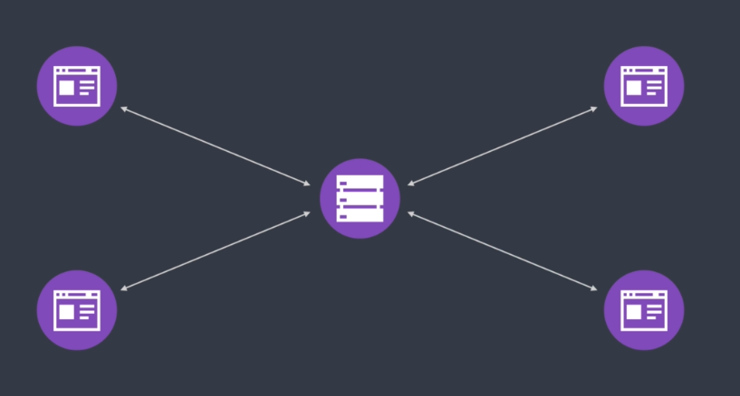
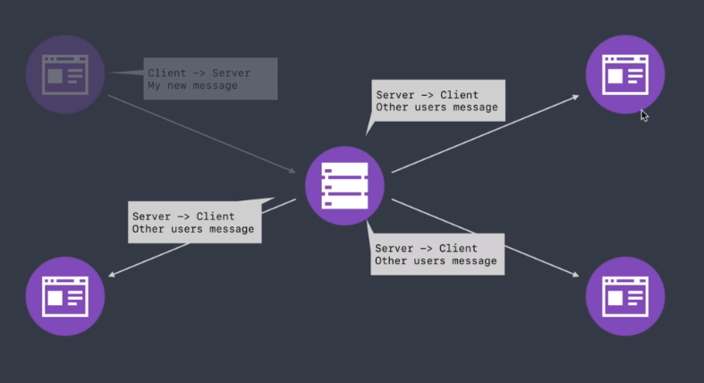

# node-course

- next to lesson 167

## About Test By Jest

- Jest/Mocha

- Extra testcase
```js
//
// User Test Ideas
//
// Should not signup user with invalid name/email/password
// Should not update user if unauthenticated
// Should not update user with invalid name/email/password
// Should not delete user if unauthenticated

//
// Task Test Ideas
//
// Should not create task with invalid description/completed
// Should not update task with invalid description/completed
// Should delete user task
// Should not delete task if unauthenticated
// Should not update other users task
// Should fetch user task by id
// Should not fetch user task by id if unauthenticated
// Should not fetch other users task by id
// Should fetch only completed tasks
// Should fetch only incomplete tasks
// Should sort tasks by description/completed/createdAt/updatedAt
// Should fetch page of tasks
```

## About Send Email
- sendgrid.com

## Websocket



- Websocket allow for full-duplex communication
- Websocket is a separate protocol from HTTP
- Persistent connection between client and server


